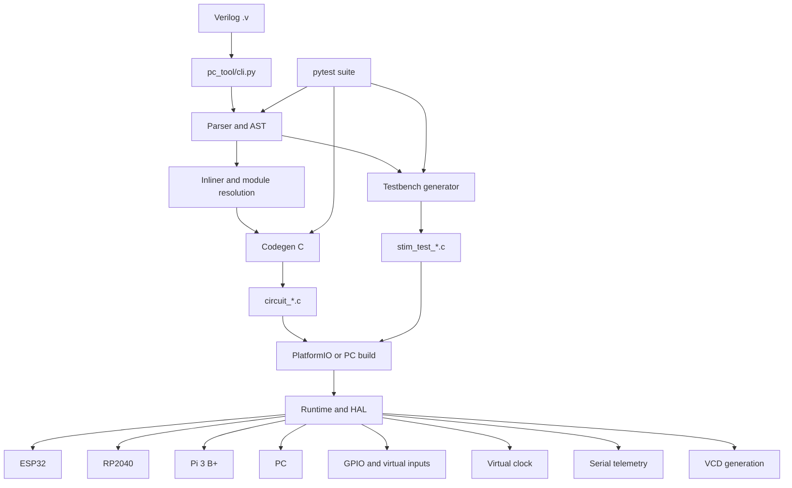

# Arquitetura do uFPGA-Emu

## Visão geral

O uFPGA-Emu implementa uma pipeline de tradução e execução:

`Verilog -> AST -> C gerado -> runtime embarcado`

O projeto é dividido em dois blocos principais:

1. `pc_tool`
2. `firmware`

O `pc_tool` traduz a descrição em Verilog para código C. O `firmware` compila e executa esse código em ESP32, RP2040, Raspberry Pi 3 B+ ou PC, com GPIO, clock virtual, telemetria e testes.

## Diagrama

## Blocos principais

### 1. Toolchain em Python (`pc_tool`)

Responsável por processar o Verilog de entrada e gerar os artefatos usados no runtime.

Arquivos centrais:

- `pc_tool/cli.py`: ponto de entrada do toolchain
- `pc_tool/parser/lexer.py`: tokenização
- `pc_tool/parser/parser.py`: parsing e construção da AST
- `pc_tool/parser/ast.py`: nós da AST
- `pc_tool/parser/inliner.py`: flatten/inlining estrutural
- `pc_tool/parser/registry.py`: registro e resolução de módulos
- `pc_tool/codegen/c_generator.py`: geração de C
- `pc_tool/testbench_generator.py`: geração de testbenches

Responsabilidades:

- ler módulos Verilog sintetizáveis
- construir AST
- resolver estrutura do circuito
- aplicar transformações necessárias para geração
- gerar `circuit_*.c`
- gerar testbenches e utilitários de validação

### 2. Runtime e firmware (`firmware`)

Responsável por executar o circuito já traduzido.

Subdivisão principal:

- `firmware/lib/hal`: abstração de hardware
- `firmware/lib/runtime`: runtime do emulador
- `firmware/src`: mains, circuitos gerados, testbenches e estímulos

Responsabilidades:

- inicializar estado do circuito
- executar `circuit_eval()` ciclicamente
- manter clock virtual
- ler entradas e escrever saídas
- fornecer telemetria serial
- gerar VCD opcionalmente
- permitir execução em PC para testes automatizados

## Interface entre os blocos

A interface entre `pc_tool` e `firmware` é o arquivo C gerado, normalmente no formato `circuit_*.c`.

Esse arquivo expõe funções padronizadas usadas pelo runtime:

- `circuit_init()`
- `circuit_eval()`
- `circuit_get_state()` quando aplicável

Isso desacopla o parsing/codegen da execução em hardware.

## Fluxo principal

1. O usuário escreve um circuito em Verilog.
2. `pc_tool/cli.py` chama parser, resolução estrutural e codegen.
3. O toolchain gera o arquivo C do circuito.
4. O PlatformIO compila esse arquivo junto com runtime e HAL.
5. O firmware roda em ESP32, RP2040, Raspberry Pi 3 B+ ou PC.
6. O loop principal:
   - atualiza o clock virtual
   - lê entradas físicas ou virtuais
   - chama `circuit_eval()`
   - escreve saídas
   - envia telemetria quando habilitada

## Entry points principais

Toolchain:

- `pc_tool/cli.py:main`

Execução em PC:

- `firmware/src/main_pc.c`
- `firmware/src/main_pc_counter.c`
- `firmware/src/main_pc_fsm_101.c`
- `firmware/src/main_pc_shift_register.c`

Execução embarcada:

- `firmware/src/main_esp32.c`
- `firmware/src/main_rp2040.cpp`
- `firmware/src/main_rpi.c` (compilação direta com `gcc`, sem PlatformIO)

## Núcleo arquitetural

Os hotspots do grafo atual mostram que a maior parte da complexidade está no toolchain Python, especialmente em:

- `parse`
- `CGenerator.generate`
- `Parser.peek`
- `Parser.advance`
- `Parser.expect`

Isso indica que o centro arquitetural do projeto está na tradução de Verilog para C. O firmware atua principalmente como camada de execução, observabilidade e integração com hardware.

## Estratégia de testes

O projeto combina três níveis de validação:

1. testes unitários de parser e codegen
2. testbenches gerados para execução no PC
3. validação em hardware real com ESP32, RP2040 e Raspberry Pi 3 B+

Arquivos principais:

- `tests/test_parser.py`
- `tests/test_testbenches.py`
- `firmware/src/stim_test_*.c`
- `firmware/src/testbench_*.c`

## Decisões estruturais importantes

- separar toolchain e runtime para manter portabilidade
- usar C como artefato intermediário executável
- manter HAL isolando diferenças entre ESP32, RP2040, Pi 3 B+ e PC
- permitir observabilidade por telemetria serial e VCD
- sustentar a validação com testes automatizados e hardware real

## Resumo em uma frase

O uFPGA-Emu é uma arquitetura em duas camadas: um front-end em Python que traduz Verilog para C e um runtime portátil que executa esse C em microcontroladores de baixo custo (ESP32, RP2040), single-board computers (Raspberry Pi 3 B+) ou no PC.
